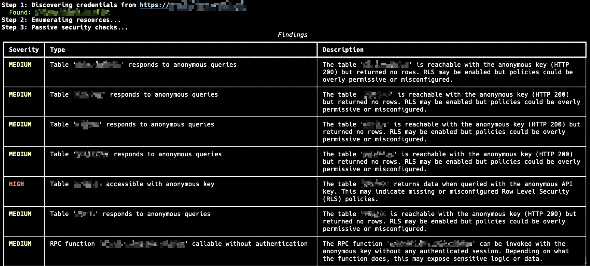

# supascan

A CLI security auditing tool for Supabase projects. Discovers credentials from public sources, enumerates exposed resources, and tests for common misconfigurations like missing Row Level Security, public storage buckets, and unauthenticated RPC functions.

`$ supascan all https://example.com`



## Features

- **Credential discovery** — extracts Supabase project refs and API keys from URLs, HTML, JS bundles (including lazy-loaded Next.js/Vite chunks), and HAR files
- **Resource enumeration** — tables, columns, RPC functions, and storage buckets via the OpenAPI spec
- **Passive security checks** — RLS misconfigurations, public buckets, unauthenticated RPCs, edge function auth
- **Active write tests** — tests anonymous INSERT / UPDATE / DELETE against each table (opt-in)
- **JSON reports** — structured output with severity ratings, risk score, affected resources, and remediation recommendations

---

## Installation

**Requirements:** Python 3.10+

```bash
git clone https://github.com/dbx0/supascan.git
cd supascan

python3 -m venv .venv
source .venv/bin/activate

pip install -e .
```

Verify:

```bash
supascan --help
```

---

## Usage

### Full scan from a URL

Discovers credentials automatically, then runs all passive checks:

```bash
supascan all https://your-target.com -o report.json
```

To also run active write tests (INSERT/UPDATE/DELETE):

```bash
supascan all https://your-target.com -o report.json --write
```

---

### Discover credentials

From a live URL (crawls HTML + linked JS chunks including lazy-loaded routes):

```bash
supascan discover https://your-target.com
```

From a local file:

```bash
supascan discover bundle.js --type js
supascan discover index.html --type html
supascan discover traffic.har --type har
```

Discovered credentials are saved to `~/.supascan/cache.json` automatically.

---

### Enumerate resources

```bash
supascan -p <project_ref> -k <anon_key> enum
# or, if credentials are cached:
supascan -p <project_ref> enum
```

Options:

| Flag | Description |
|---|---|
| `--tables / --no-tables` | Enumerate tables (default: on) |
| `--rpc / --no-rpc` | Enumerate RPC functions (default: on) |
| `--buckets / --no-buckets` | Enumerate storage buckets (default: on) |

---

### Passive security checks

```bash
supascan -p <project_ref> -k <anon_key> test -o findings.json
```

Checks for:
- Tables readable with the anonymous key (missing RLS)
- Publicly accessible storage buckets
- RPC functions callable without authentication
- Edge functions that do not require a JWT

Run specific checks only:

```bash
supascan -p <project_ref> -k <anon_key> test --rls --buckets
```

---

### Active write tests

> **Warning:** This sends real INSERT, UPDATE, and DELETE requests. Only use against targets you are authorized to test.

```bash
supascan -p <project_ref> -k <anon_key> test-write -o write.json
```

Test specific tables only:

```bash
supascan -p <project_ref> -k <anon_key> test-write --tables users --tables profiles
```

---

### Query a table

```bash
supascan -p <project_ref> -k <anon_key> query users --limit 50
supascan -p <project_ref> -k <anon_key> query users --format csv
```

---

### Dump all accessible tables

```bash
supascan -p <project_ref> -k <anon_key> dump --out-dir ./dump
```

---

### Inspect a JWT

```bash
supascan check-jwt eyJhbGciOiJIUzI1NiIsInR5cCI6IkpXVCJ9...
```

---

### Manage cached credentials

```bash
supascan cached list
supascan cached remove <project_ref>
supascan cached clear
```

Discovered credentials are saved automatically. Once cached, you can omit `-k` and pass only `-p`:

```bash
supascan -p <project_ref> enum
supascan -p <project_ref> query users
supascan -p <project_ref> test -o findings.json
```

---

## Output Format

All commands accept `-o <file>` to write a JSON report:

```json
{
  "project_ref": "abcdefghijklmnopqrst",
  "url": "https://abcdefghijklmnopqrst.supabase.co",
  "summary": {
    "critical": 0,
    "high": 1,
    "medium": 3,
    "low": 0,
    "info": 0
  },
  "risk_score": 11,
  "findings": [
    {
      "severity": "high",
      "title": "Table 'users' accessible with anonymous key",
      "description": "The table 'users' returns data when queried with the anonymous API key...",
      "affected_resource": "Table: users",
      "recommendation": "Enable RLS on this table... ALTER TABLE users ENABLE ROW LEVEL SECURITY;",
      "evidence": {
        "table": "users",
        "columns": ["email", "id", "name"],
        "row_count": 42,
        "sample_data": [{ "id": "...", "email": "..." }]
      }
    }
  ]
}
```

**Risk score** is calculated as: `critical × 10 + high × 5 + medium × 2 + low × 1`

---

## Global Options

These can be set on any command:

| Option | Env var | Description |
|---|---|---|
| `-p, --project-ref` | `SUPABASE_PROJECT_REF` | Supabase project reference ID |
| `-k, --anon-key` | `SUPABASE_ANON_KEY` | Supabase anonymous API key |
| `-o, --output` | — | Write JSON report to file |
| `-v, --verbose` | — | Print each HTTP request and status |

You can also use environment variables to avoid passing credentials on every command:

```bash
export SUPABASE_PROJECT_REF=abcdefghijklmnopqrst
export SUPABASE_ANON_KEY=eyJ...

supascan enum
supascan test -o findings.json
```

---

## Disclaimer

This tool is intended for authorized security testing, bug bounty research, and auditing your own Supabase projects. Do not use it against targets without explicit permission.
